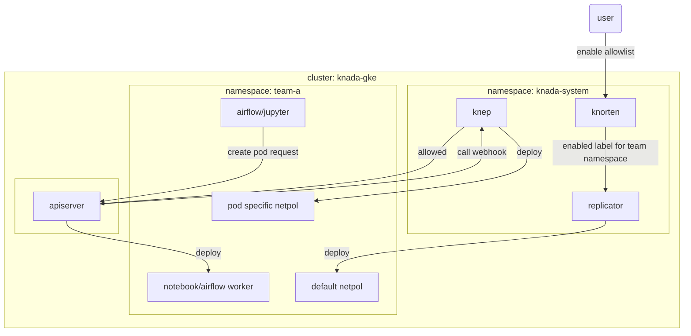

# Knada NetworkPolicy Admission Webhook - knep
Knada Network Policy Admission Webhook - knep - er en [Validating Admission Webhook](https://kubernetes.io/docs/reference/access-authn-authz/extensible-admission-controllers) som oppretter egress [FQDN network policies](https://github.com/GoogleCloudPlatform/gke-fqdnnetworkpolicies-golang) og [standard network policies](https://kubernetes.io/docs/concepts/services-networking/network-policies/) for Jupyterhub og Airflow workers for å tillate trafikk ut fra poddene til en liste med hoster som brukerne selv angir. I utgangspunktet vil podder ha en [default egress network policy](https://github.com/nais/knada-gcp/blob/main/templates/team/team-netpols.yaml#L23-L46) som tillater trafikk ut til det som er felles (som f.eks. `private.googleapis.com`). Denne default network policien rulles ut i team namespacet av [replicator](https://github.com/nais/replicator) når brukeren gjennom Knorten enabler allowlist featuren for teamet sitt. Alt utover det angitt i default network policien må brukerne selv spesifisere for enten notebooken sin eller hver enkelt task i Airflow DAGene sine som beskrevet i [KNADA docs](https://docs.knada.io/analyse/allowlisting/).

Admission Webhook callbacken vil se etter podder som har labels `component: singleuser-server` (for notebook podder) og `dag_id` (for Airflow pods), og lage FQDN og vanlige network policies spesifikt for podden som tillater trafikk ut til hostene angitt i `allowlist` annotasjonen til pod ressursen før podden blir tillat å starte. Etter at podden terminerer (enten med suksess eller feil) vil kontrolleren fjerne de pod spesifikke network policiene.

Den resulterende egress network policien for en Jupyterhub eller Airflow worker pod blir da en kombinasjon av default policien og de task spesifikke policiene.
