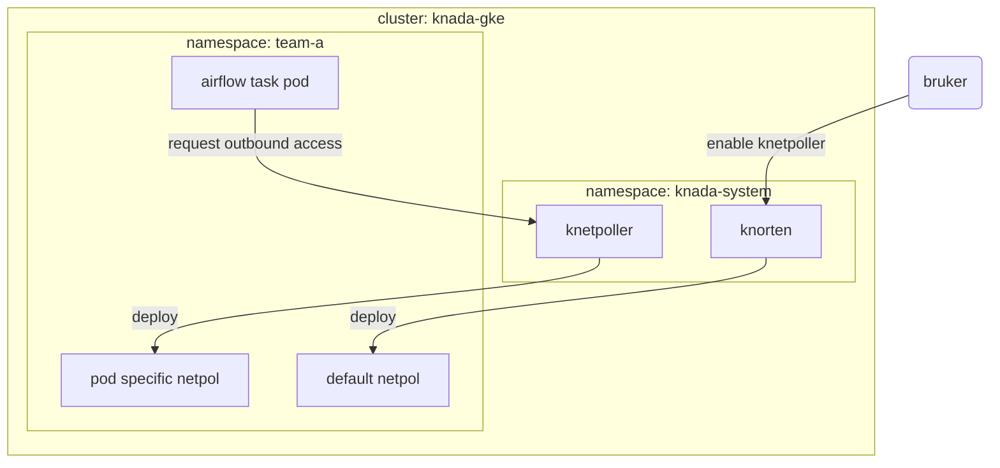

# Knada NetworkPolicy Controller
Knada Network Policy Controller - knetpoller - er en [Kubernetes controller](https://kubernetes.io/docs/concepts/architecture/controller) som oppretter egress network policies for airflow worker podder for å tillate trafikk ut fra poddene til en liste med hoster som brukerne selv angir. I utgangspunktet vil airflow worker podder ha en [default egress network policy](https://github.com/nais/knada-gcp/blob/main/templates/knorten/airflow-default-netpol.yaml) som tillater trafikk ut til det som er felles for alle airflow workere (som f.eks. github og google storage api). Denne default network policien deployes av Knorten når featuren enables for teamet. Alt utover det angitt i default network policien må brukerne selv spesifisere for hver enkelt task i DAGene sine som beskrevet i [KNADA docs](https://docs.knada.io/analyse/airflow/knada-airflow/#trafikk-fra-airflow-workere).

Kontrolleren vil se etter podder som har labels `component: worker` og `release: airflow` og lage en network policy spesifikt for podden som tillater trafikk ut til hostene angitt i `allowlist` annotasjonen til pod ressursen. Etter at podden terminerer (enten med suksess eller feil) vil kontrolleren fjerne denne pod spesifikke network policien.

Den resulterende egress network policy for en airflow worker pod blir da en kombinasjon av default policien og den task spesifikke policien.
